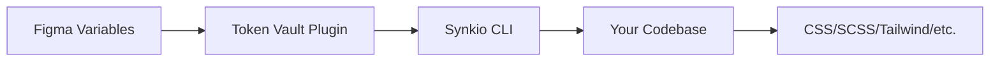

# Introduction

**Synkio** is a designer-first design token synchronization tool that syncs Figma Variables to code with zero friction.

## The Problem

Design systems are powerful, but keeping design tokens synchronized between Figma and code is a constant struggle:

- 🔄 **Manual sync is tedious**: Copy-pasting values, converting formats, updating references
- 🐛 **Errors creep in**: Typos, outdated values, inconsistent naming
- ⏰ **Slows down iteration**: Design changes require coordinated updates across tools
- 💔 **Breaks collaboration**: Designers and developers work in silos

**Synkio solves this.** It creates a seamless pipeline from Figma Variables directly to your codebase.

## Why Synkio?

### For Designers
- **Stay in Figma**: Export tokens with one click using the Token Vault plugin
- **No technical setup**: No need to understand build tools or code structure
- **Instant updates**: Changes in Figma automatically available to developers
- **Full control**: Designers own the tokens, not the code

### For Developers
- **Zero friction**: One command syncs all tokens (`synkio sync`)
- **Works with your stack**: CSS, SCSS, Tailwind, JS/TS - all supported
- **Smart migrations**: Automatically detect and update token references when they change
- **Type-safe**: Optional TypeScript definitions for tokens

### For Teams
- **Single source of truth**: Figma Variables are the baseline
- **Automated workflows**: Integrate with CI/CD for continuous sync
- **Change tracking**: See exactly what changed with visual diffs
- **Safe rollbacks**: Restore previous token versions instantly

## How it works



1. **Export**: Designers export tokens from Figma using the Token Vault plugin
2. **Sync**: Developers run `synkio sync` to fetch the latest tokens
3. **Build**: Tokens are automatically transformed for your platform (CSS, SCSS, Tailwind, etc.)
4. **Migrate**: When tokens change, Synkio can automatically update references in your code

## Quick Start

Get started in less than 5 minutes:

```bash
# Install Synkio CLI
npm install -g @synkio/core

# Initialize in your project (interactive wizard)
synkio init

# Sync tokens from Figma
synkio sync
```

That's it! Your tokens are now in your codebase, organized and ready to use.

[Continue to Getting Started →](./getting-started)

## Real-World Example

Here's what a typical workflow looks like:

### 1. Designer updates tokens in Figma
```
Color/Primary: #3B82F6 → #2563EB
Spacing/Medium: 16px → 20px
```

### 2. Developer syncs changes
```bash
$ synkio sync
✓ Fetched 142 tokens from Figma
✓ Detected 2 changes
  • Color/Primary updated
  • Spacing/Medium updated
✓ Updated baseline
✓ Built tokens to CSS variables
```

### 3. Synkio detects usage (optional migration)
```bash
$ synkio migrate --scan
Found 87 references to changed tokens:
  • Color/Primary: 23 files
  • Spacing/Medium: 64 files

$ synkio migrate --plan
Generated migration plan (migration-plan.md)

$ synkio migrate --apply
✓ Updated 87 files
✓ All token references migrated
```

### 4. Code is automatically updated
```css
/* Before */
.button {
  background: var(--color-primary); /* #3B82F6 */
  padding: var(--spacing-medium);   /* 16px */
}

/* After */
.button {
  background: var(--color-primary); /* #2563EB ✓ */
  padding: var(--spacing-medium);   /* 20px ✓ */
}
```

## Architecture

Synkio is built as a monorepo with three main packages:

- **`@synkio/core`**: CLI and programmatic API
- **Token Vault**: Figma plugin for exporting tokens
- **Dashboard**: Web app for managing token workflows (coming soon)

## Features

### Core Features

- ✅ Figma Variables synchronization via REST API
- ✅ Flexible organization (by mode or by group)
- ✅ Style Dictionary integration (optional)
- ✅ Smart baseline tracking and diffing
- ✅ Interactive setup wizard

### Migration System

- ✅ Automatic token usage detection
- ✅ Multi-platform support (CSS, SCSS, Tailwind, JS/TS)
- ✅ Safe, user-approved migrations
- ✅ Rollback support

### Coming Soon

- 🚧 Token Vault plugin (Figma)
- 🚧 Dashboard for team collaboration
- 🚧 CI/CD integrations
- 🚧 VS Code extension

## What Makes Synkio Different?

### vs. Manual Export/Import
- ❌ Manual: Copy-paste values, error-prone, time-consuming
- ✅ Synkio: One command, automated, reliable

### vs. Figma Plugins (Tokens Studio, etc.)
- ❌ Other plugins: Complex JSON format, manual commit/push required
- ✅ Synkio: Native Figma Variables, automatic CLI sync

### vs. Style Dictionary Alone
- ❌ Style Dictionary only: Manual token input, no Figma connection
- ✅ Synkio: Figma → Code pipeline, optional Style Dictionary integration

### vs. Design APIs (Specify, Zeroheight)
- ❌ Design APIs: Vendor lock-in, limited customization
- ✅ Synkio: Open source, full control, works offline

## Use Cases

### Design System Teams
Maintain consistency across products with centralized token management and automated distribution.

### Product Development
Iterate faster with design changes flowing directly to code without manual coordination.

### Rebrand Projects
Update brand colors, typography, spacing across entire codebase with safe, automated migrations.

### Multi-Platform Apps
Single source of truth for tokens shared between web, mobile, desktop applications.

## Community & Support

- 📚 [Documentation](https://docs.synkio.io)
- 🌐 [Website](https://synkio.io)
- 💻 [GitHub Repository](https://github.com/synkio/synkio)
- 🐛 [Report Issues](https://github.com/synkio/synkio/issues)

---

**Ready to get started?** Head to the [Getting Started guide](./getting-started) →
